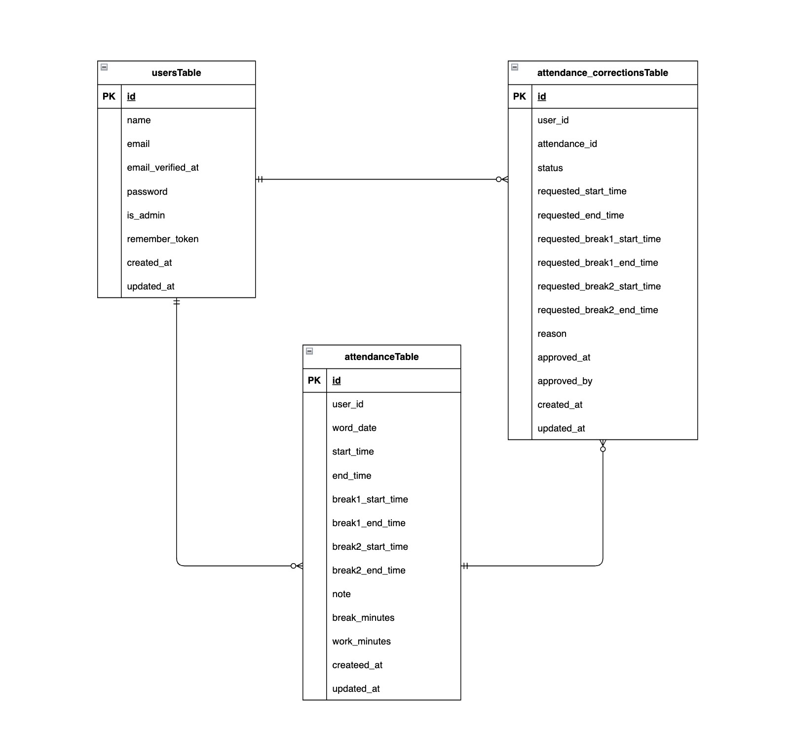

# attendance-management

## 環境構築

**Docker ビルド**

1. `git clone git@github.com:itanohiroyuki/attendance-management.git`
2. cd attendance-management
3. DockerDesktop アプリを立ち上げる
4. `docker-compose up -d --build`

**Laravel 環境構築**

1. `docker-compose exec php bash`
2. `composer install`
3. 「.env.example」ファイルを 「.env」ファイルに命名を変更。または、新しく.env ファイルを作成
4. .env に以下の環境変数を追加

```text
DB_CONNECTION=mysql
DB_HOST=mysql
DB_PORT=3306
DB_DATABASE=laravel_db
DB_USERNAME=laravel_user
DB_PASSWORD=laravel_pass
SESSION_DRIVER=database

MAIL_FROM_ADDRESS=アドレス形式で指定
```

5. アプリケーションキーの作成

```bash
php artisan key:generate
```

6. マイグレーションの実行

```bash
php artisan migrate
```

7. シーディングの実行

```bash
php artisan db:seed
```

## 使用技術(実行環境)

- PHP 8.4.1
- Laravel 8.83.8
- MariaDB 11.8.3
- Fortify v1.19.1

## テーブル仕様

### users テーブル

| カラム名          | 型        | primary key | unique key | not null | foreign key |
| ----------------- | --------- | ----------- | ---------- | -------- | ----------- |
| id                | bigint    | ◯           |            | ◯        |             |
| name              | string    |             |            | ◯        |             |
| email             | string    |             | ◯          | ◯        |             |
| email_verified_at | timestamp |             |            |          |             |
| password          | string    |             |            | ◯        |             |
| is_admin          | boolean   |             |            | ◯        |             |
| remember_token    | string    |             |            |          |             |
| created_at        | timestamp |             |            | ◯        |             |
| updated_at        | timestamp |             |            | ◯        |             |

### attendance テーブル

| カラム名          | 型        | primary key | unique key | not null | foreign key |
| ----------------- | --------- | ----------- | ---------- | -------- | ----------- |
| id                | bigint    | ◯           |            | ◯        |             |
| user_id           | bigint    |             | ◯          | ◯        | users(id)   |
| work_date         | date      |             | ◯          | ◯        |             |
| start_time        | datetime  |             |            | ◯        |             |
| end_time          | datetime  |             |            | ◯        |             |
| break1_start_time | time      |             |            |          |             |
| break1_end_time   | time      |             |            |          |             |
| break2_start_time | time      |             |            |          |             |
| break2_end_time   | time      |             |            |          |             |
| note              | text      |             |            |          |             |
| break_minutes     | integer   |             |            |          |             |
| work_minutes      | integer   |             |            |          |             |
| created_at        | timestamp |             |            | ◯        |             |
| updated_at        | timestamp |             |            | ◯        |             |

### attendance_corrections テーブル

| カラム名                    | 型          | primary key | unique key | not null | foreign key    |
| --------------------------- | ----------- | ----------- | ---------- | -------- | -------------- |
| id                          | bigint      | ◯           |            | ◯        |                |
| user_id                     | bigint      |             |            | ◯        | users(id)      |
| attendance_id               | bigint      |             |            | ◯        | attendance(id) |
| status                      | tinyinteger |             |            | ◯        |                |
| requested_start_time        | time        |             |            |          |                |
| requested_end_time          | time        |             |            |          |                |
| requested_break1_start_time | time        |             |            |          |                |
| requested_break1_end_time   | time        |             |            |          |                |
| requested_break2_start_time | time        |             |            |          |                |
| requested_break2_end_time   | time        |             |            |          |                |
| reason                      | text        |             |            |          | ◯              |
| approved_at                 | timestamp   |             |            |          |                |
| approved_by                 | bigint      |             |            |          | users(id)      |
| created_at                  | timestamp   |             |            | ◯        |                |
| updated_at                  | timestamp   |             |            | ◯        |                |

## ER 図



## テストアカウント(ダミーデータ）
name: 西　怜奈  
email: reina.n@coachtech.com  
password: password  
-------------------------
name: 管理者  
email: admin@coachtech.com  
password: password  
-------------------------

## PHPUnitを利用したテストに関して
以下のコマンド:  
```
//テスト用データベースの作成
docker-compose exec mysql bash
mysql -u root -p
//パスワードはrootと入力
create database test_database;

docker-compose exec php bash
php artisan migrate:fresh --env=testing
./vendor/bin/phpunit
```

## URL

- 開発環境：http://localhost/
- phpMyAdmin：http://localhost:8080/
- mailhog：http://localhost:8025
